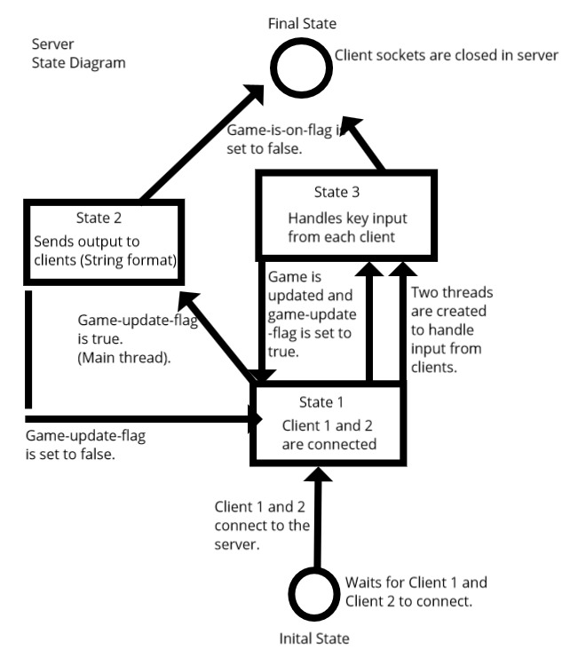
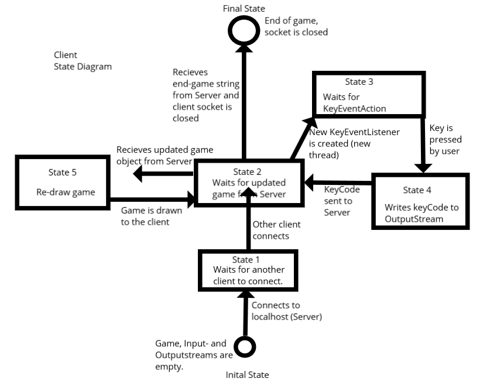

# serverClientProtocol
An application with one server and two clients. Sends UTF-8 strings to each other to communicate.

# Protokoll

## Description of the application

* Two players with three lives each, one ball. The goal of the game is to throw the ball at the opponenet until one of them runs out of lives. The game ends and each player recieves a winner or loser message in the terminal.
* Arrow keys are used to navigate and spacebar is used to throw the boll in the direction of the player. The players pick up the ball by walking over it. 

## Description of the data that is being sent between the server and client. 

* Strings are sent between the server och client in UTF8-format. To the client the game string is sent which has been updated by the server (the game string is the game's graphic). The client draws the game field by printing out the latest game string recieved by the server.
* To the server keyinput is sent in form of strings with key codes (*eng. key codes*). The client can only send key codes for the arrow keys and spacebar and no other keys.
* The server has two simulatnious threads that contronl the input that come from the clients. The changes made to the game are only done if the game has recieved new changes.
* The client has two threads that are done in parallel: one thread recieves input from the server and prints it, while the other thread listens for specific key input which then is sent to the server.
* The server will close the connection to both clients when the game is over. 

## State diagram for server

## State diagram for client

